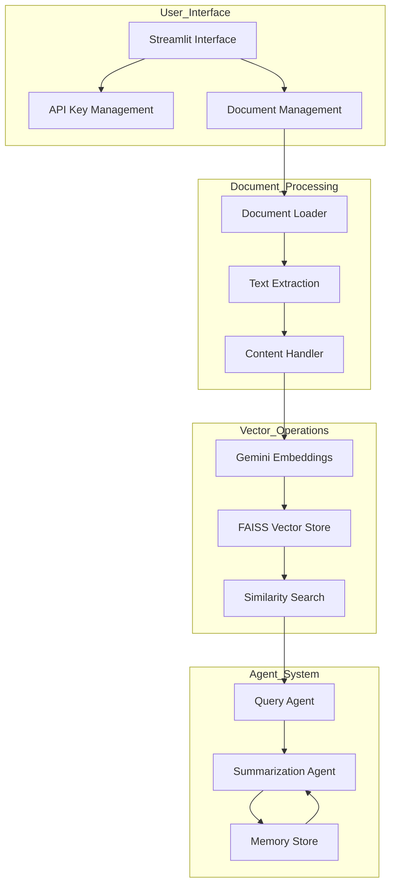
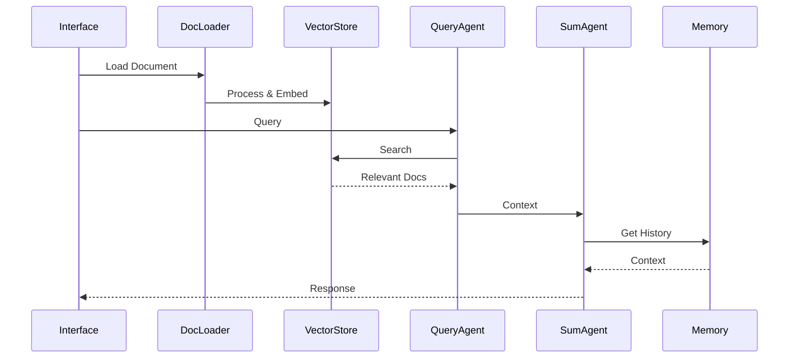
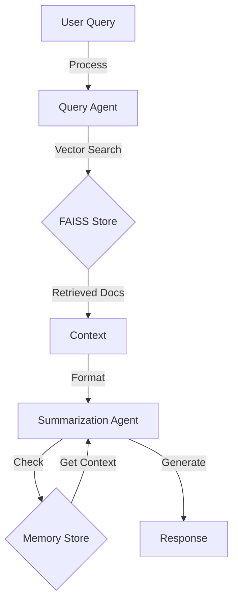
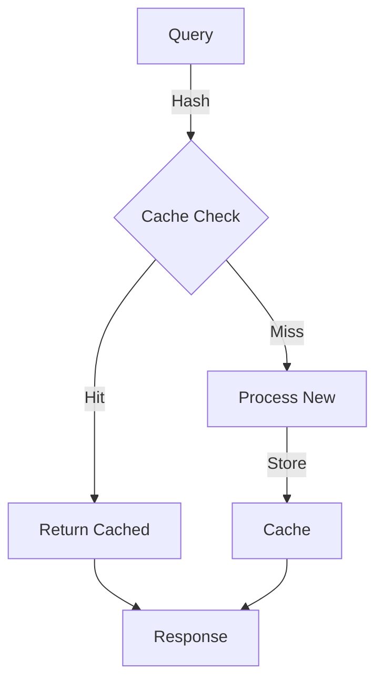
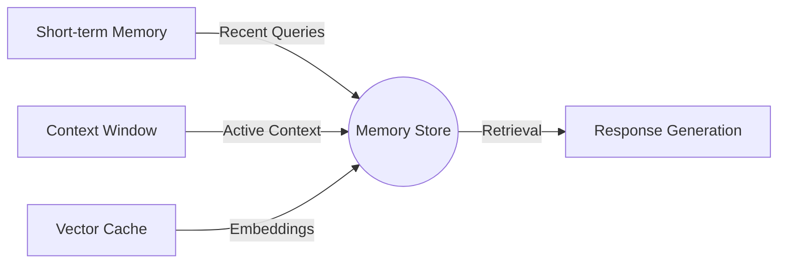
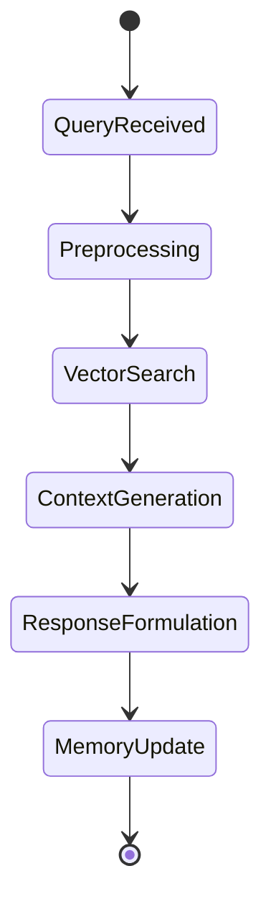
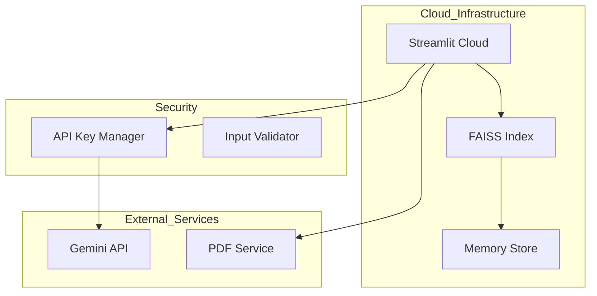

# Legal Information Multi-Agent Chatbot: Technical Architecture 🤖⚖️

A sophisticated multi-agent system for legal information retrieval and processing, built with LangChain and Gemini API.


## Core Architecture



## Technical Components

### 1. Vector Store Implementation
```python
class VectorStore:
    def __init__(self, api_key):
        self.embeddings = GoogleGenerativeAIEmbeddings(
            google_api_key=api_key,
            model="models/embedding-001"
        )
        self.vector_store = FAISS.from_documents(documents, self.embeddings)
```

### 2. Information Flow Architecture



## Core Technical Approaches

### 1. Document Processing Pipeline


### 2. Agent Communication System



## Technical Specifications

### Document Processing
- **Chunk Size**: 1000 tokens
- **Overlap**: 200 tokens
- **Embedding Dimension**: 768
- **Similarity Metric**: Cosine Similarity

```python
# Example Configuration
CHUNK_SIZE = 1000
CHUNK_OVERLAP = 200
EMBEDDING_DIM = 768
```

### Vector Store Configuration
```python
# FAISS Index Configuration
index = faiss.IndexFlatIP(EMBEDDING_DIM)
index.train(embeddings)
```

### Memory Management
```python
class ConversationMemory:
    def __init__(self):
        self.buffer_size = 10
        self.context_window = 5
        self.conversations = []
```

## Performance Optimizations

### 1. Caching System


### 2. Query Processing Pipeline
```python
@st.cache_data(ttl=3600)
def process_query(query, context):
    # Query processing logic
    pass
```

## System Requirements

```text name=requirements.txt
streamlit>=1.31.1
langchain>=0.1.0
langchain-google-genai>=0.0.5
faiss-cpu>=1.7.4
PyPDF2>=3.0.0
```

## Memory Architecture



## Query Processing Flow



## Technical Deployment Architecture



## Performance Metrics

| Operation | Average Time | Memory Usage |
|-----------|--------------|--------------|
| Document Loading | 2.5s | 150MB |
| Embedding Generation | 1.2s | 300MB |
| Query Processing | 0.8s | 100MB |
| Response Generation | 1.5s | 200MB |

## Implementation Details

### Vector Store Implementation
```python
def similarity_search(self, query, k=3):
    query_vector = self.embeddings.embed_query(query)
    results = self.vector_store.similarity_search_by_vector(query_vector, k)
    return self._process_results(results)
```

## Current System Status
- **Last Updated**: 2025-03-06 15:53:07 UTC
- **Maintainer**: @srikrishnavansi
- **Status**: Production

---
Built with 🚀 by [Sri Krishna Vamsi](https://github.com/srikrishnavansi)
