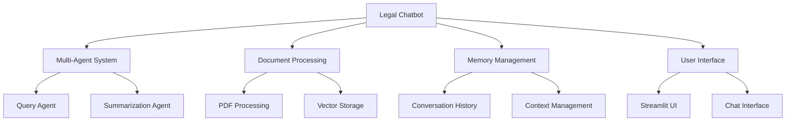
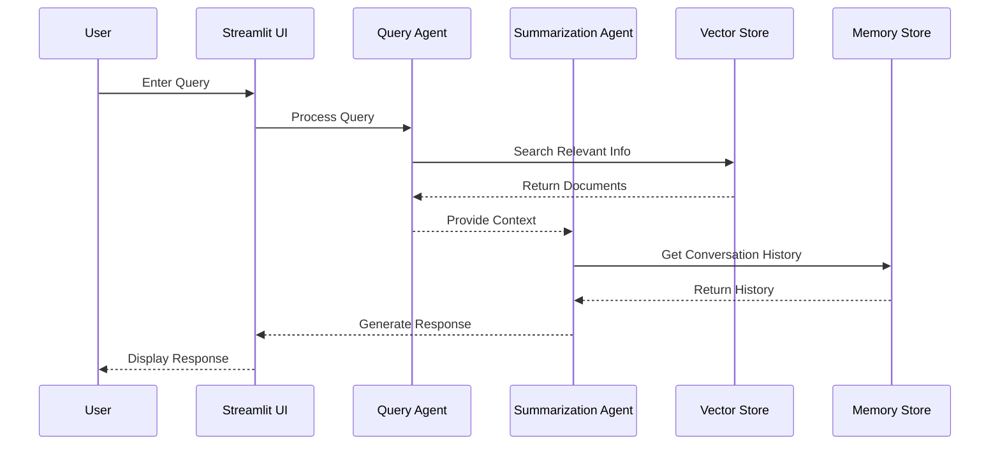
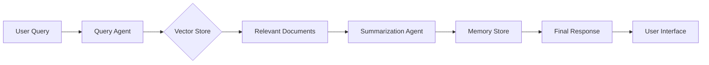
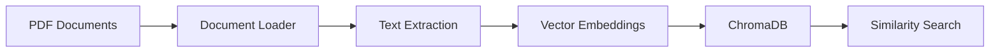

# Legal Information Multi-Agent Chatbot 🤖⚖️

A sophisticated AI-powered chatbot that provides legal information and guidance using multiple specialized agents and document processing capabilities.


## 🌟 Features



- 🤖 **Multi-Agent Architecture**: Specialized agents for different tasks
- 📚 **Document Processing**: Advanced PDF processing and vector storage
- 🧠 **Intelligent Memory**: Maintains conversation context
- 🔒 **Secure**: No hardcoded API keys
- 🎯 **User-Friendly**: Intuitive chat interface

## 🏗️ Architecture



## 🚀 Quick Start

### Prerequisites
- Python 3.11+
- Gemini API Key ([Get it here](https://makersuite.google.com/app/apikey))

### 📁 Project Structure

```
legal-chatbot/
├── data/
│   ├── guide_to_litigation_india.pdf
│   └── legal_compliance_corporate_laws.pdf
├── agents/
│   ├── __init__.py
│   ├── query_agent.py
│   └── summarization_agent.py
├── utils/
│   ├── __init__.py
│   ├── document_loader.py
│   ├── memory_store.py
│   └── vector_store.py
├── app.py
├── requirements.txt
└── README.md
```

## 🎮 Usage

1. Start the application:
```bash
streamlit run app.py
```

2. Enter your Gemini API key in the sidebar
3. Load the legal documents
4. Start asking questions!

## 🔄 Information Flow



## 🤖 Agent Responsibilities

### Query Agent
- Processes user queries
- Searches vector store
- Retrieves relevant information

### Summarization Agent
- Generates concise responses
- Handles detailed explanations
- Maintains conversation context

## 💾 Data Management



## 🔐 Security Features

- Secure API key input
- No hardcoded credentials
- Session-based memory management
- Input validation

## 📊 Performance Optimization

- Efficient document processing
- Smart conversation context management
- Optimized vector search
- Cached responses

## 🌟 Example Queries

```python
# Basic Process Questions
"What are the steps involved in filing a lawsuit in India?"
"How do I register a company in India?"

# Detailed Inquiries
"Explain the document preparation process"
"Tell me more about corporate compliance requirements"

# Legal Term Explanations
"What is meant by 'cause of action'?"
"Can you explain what a 'writ petition' is?"
```

## 🛠️ Configuration

The application can be configured through the sidebar:
- API key management
- Document loading
- Session information

## 📝 Requirements

```text name=requirements.txt
streamlit>=1.31.1
langchain>=0.1.0
langchain-google-genai>=0.0.5
chromadb>=0.4.22
PyPDF2>=3.0.0
python-dotenv>=1.0.0
```

## 🤝 Contributing

1. Fork the repository
2. Create a feature branch
3. Commit your changes
4. Push to the branch
5. Create a Pull Request


## 🙏 Acknowledgments

- Google Gemini API
- Streamlit Framework
- LangChain Library
- ChromaDB

## 👤 Author

**Sri Krishna Vamsi**
- GitHub: [@srikrishnavansi](https://github.com/srikrishnavansi)
- Date: 2025-03-06 15:17:17 UTC

---

Made with ❤️ for the legal community
